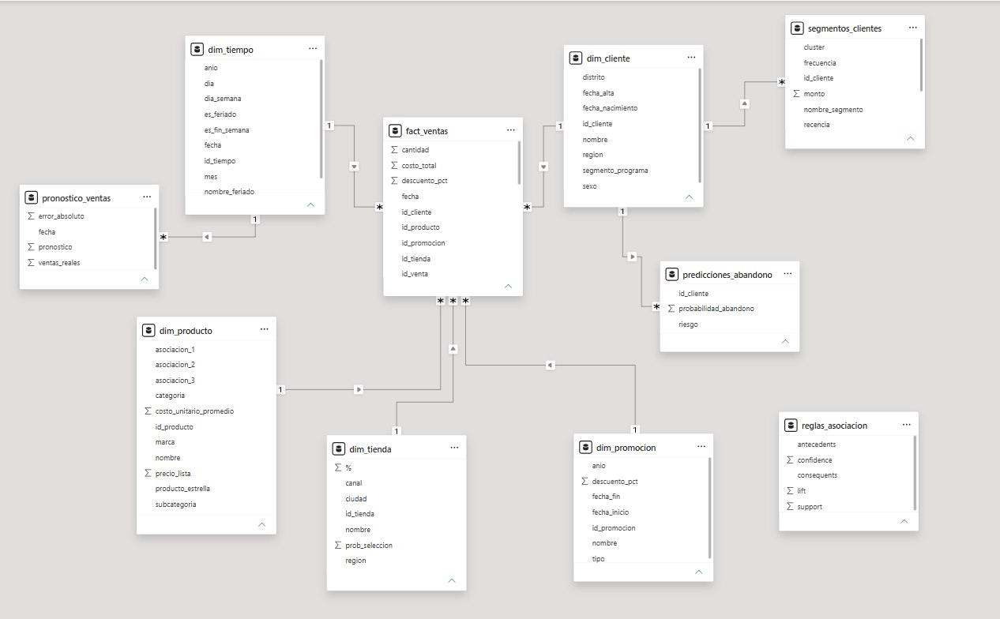
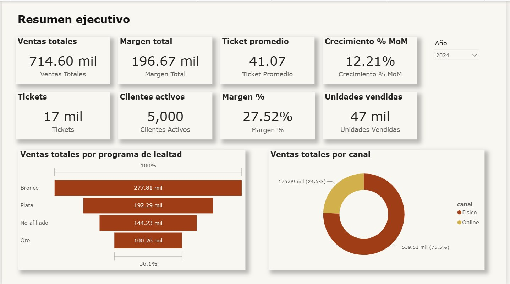
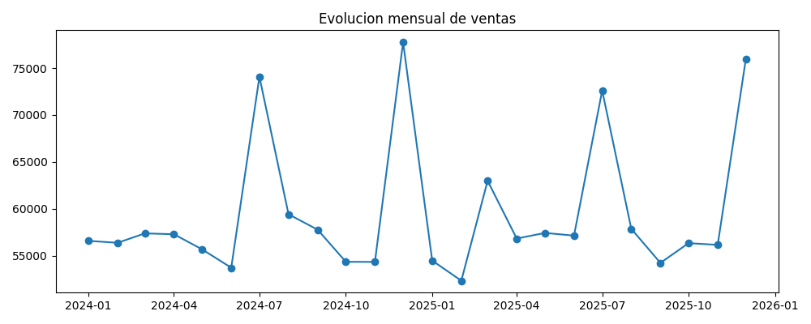
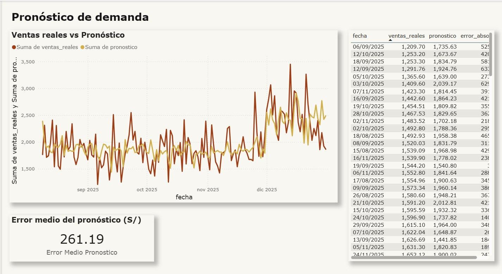

# Universidad Nacional Mayor de San Marcos

**Facultad de Ingeniería de Sistemas e Informática**
**Escuela Profesional de Ingeniería de Software**

---

# Informe del Proyecto Grupal

## Solución integral de Inteligencia de Negocios para una empresa retail ficticia

**Asignatura:** Inteligencia de Negocios
**Docente:** Mg. Juan Gamarra Moreno
**Semestre:** 2026-1
**Repositorio:** <https://github.com/KarloToro/Business-Intelligence-Final-Proyect.git>
**Archivo Power BI:** `powerbi/RetailBI.pbix`

| Integrante | Rol principal |
| --- | --- |
| Karlo Toro | Generación de datos |
| Hector Huapaya | Científico de datos |
| Leslie Diaz | Arquitecto de BI |
| Alex Palomino | Analista de negocio y editor del documento |

**Lima, Perú**
**Fecha:** [PENDIENTE: completar fecha de entrega]

---

# 1. Carátula e índice

## 1.1 Índice

1. Carátula e índice
2. Resumen ejecutivo del proyecto y principales hallazgos
3. Descripción de la empresa ficticia, problemática y preguntas de negocio
4. Generación de datos sintéticos
5. Parte 1: Datamart
6. Parte 2: Visualización
7. Parte 3: Clasificación
8. Parte 4: Segmentación
9. Parte 5: Asociación
10. Parte 6: Regresión
11. Reflexión ética e integridad; anexo de prompts
12. Conclusiones, recomendaciones y tabla de contribución

---

# 2. Resumen ejecutivo del proyecto y principales hallazgos

El proyecto desarrolla una solución integral de Inteligencia de Negocios para una empresa retail ficticia, orientada a convertir datos transaccionales sintéticos en información útil para la toma de decisiones. La solución integra generación de datos, datamart, visualización, clasificación, segmentación, asociación y regresión.

La base de trabajo contiene 5,000 clientes sintéticos, 506 productos, 15 tiendas o canales, 29 promociones, 34,755 tickets y 55,858 líneas de venta para el periodo 2024-2025. La validación del datamart confirma consistencia en claves, fechas, promociones vigentes, canastas y métricas derivadas.

Los principales resultados de negocio son:

| Indicador | Resultado |
| --- | ---: |
| Ventas totales | S/ 1,428,828.48 |
| Ganancia total | S/ 392,905.08 |
| Tickets de venta | 34,755 |
| Líneas de venta | 55,858 |
| Clientes con venta | 5,000 |
| Productos vendidos | 506 |

Principales hallazgos:

- Los productos estrella generan S/ 762,080.07 en ingresos, por encima de los productos no estrella.
- El segmento Bronce aporta el mayor ingreso total dentro del programa de fidelización.
- El modelo de abandono identifica 810 clientes en riesgo alto y 505 en riesgo medio.
- La segmentación RFM agrupa a los clientes en cuatro perfiles comerciales.
- El análisis de asociación genera 26 reglas de canasta de mercado; la regla con mayor lift relaciona Bebidas + Lácteos con Snacks y Dulces.
- El modelo de regresión con Gradient Boosting alcanza MAPE de 13.45%, útil como referencia de planificación.

---

# 3. Descripción de la empresa ficticia, problemática y preguntas de negocio

## 3.1 Empresa ficticia

La empresa analizada es una cadena retail ficticia de operación omnicanal, con tiendas físicas y canal online en distintas regiones del Perú. Comercializa productos de consumo masivo y categorías complementarias como abarrotes, bebidas, lácteos, frutas y verduras, carnes y aves, limpieza, cuidado personal, hogar, bebés, mascotas, congelados, snacks y dulces.

Para efectos del caso, el proyecto puede presentarse como **AndesMarket S.A.C.**, nombre de referencia utilizado para dar coherencia al informe y a la solución BI.

## 3.2 Problemática

La gerencia necesita pasar de datos operativos dispersos a una solución analítica que permita:

- monitorear ventas, margen y rentabilidad;
- evaluar productos, categorías, tiendas y canales;
- identificar clientes en riesgo de abandono;
- segmentar clientes para campañas diferenciadas;
- detectar oportunidades de venta cruzada;
- pronosticar ventas para apoyar inventario y campañas.

## 3.3 Objetivo general

Diseñar y sustentar una solución integral de Inteligencia de Negocios para una empresa retail ficticia, utilizando datos sintéticos, notebooks de Python y Power BI para apoyar decisiones comerciales y gerenciales.

## 3.4 Preguntas de negocio

- ¿Cómo evolucionan las ventas y el margen por periodo, categoría, tienda y canal?
- ¿Qué clientes presentan mayor probabilidad de abandono?
- ¿Qué segmentos de clientes existen y qué estrategia corresponde a cada uno?
- ¿Qué categorías se compran juntas y qué promociones cruzadas conviene impulsar?
- ¿Cuál es la venta esperada para apoyar planificación de inventario y campañas?

---

# 4. Generación de datos sintéticos: esquema, volúmenes, distribuciones y problemas de calidad

## 4.1 Alcance de los datos

Los datos son sintéticos y fueron generados con fines académicos. No contienen información real de personas ni empresas. La fuente limpia y oficial se encuentra en `data/processed/`.

| Tabla | Filas | Uso principal |
| --- | ---: | --- |
| `dim_cliente.csv` | 5,000 | Perfil de clientes |
| `dim_producto.csv` | 506 | Catálogo de productos |
| `dim_tienda.csv` | 15 | Tiendas y canales |
| `dim_promocion.csv` | 29 | Campañas y descuentos |
| `dim_tiempo.csv` | 731 | Calendario |
| `fact_ventas.csv` | 55,858 | Líneas de venta |

## 4.2 Reglas de realismo

La generación considera reglas de negocio orientadas a simular una operación retail:

- todos los clientes realizan al menos una compra;
- los segmentos superiores tienen mayor probabilidad de recompra;
- las tiendas se asignan dentro de la región del cliente;
- una parte del catálogo se identifica como producto estrella;
- las promociones solo aplican dentro de su periodo de vigencia;
- los tickets pueden contener múltiples líneas de venta;
- existen asociaciones entre categorías para análisis de canasta.

## 4.3 Calidad de datos

El notebook `notebooks/01_datamart_etl.ipynb` y el script `scripts/validar_dataset.py` validan la versión procesada del dataset. Los resultados confirman claves foráneas consistentes, fechas válidas, promociones dentro de vigencia y métricas derivadas correctamente calculadas.

**Observación:** la estructura ideal del proyecto contempla una carpeta `data/raw/` con datos crudos y problemas de calidad. En el repositorio actual se observa principalmente la versión procesada. Si el equipo conserva datos crudos fuera del repositorio, debe incorporarlos o justificar esta diferencia en la entrega final.

---

# 5. Parte 1 — Datamart: modelo dimensional, ETL, diccionario y modelo en Power BI

## 5.1 Modelo dimensional

El datamart sigue un esquema estrella con `fact_ventas` como tabla central y cinco dimensiones: cliente, producto, tienda, promoción y tiempo. El grano de la tabla de hechos es la línea individual de venta (`id_venta` + `numero_linea`).

Relaciones principales:

| Relación | Tipo esperado |
| --- | --- |
| `fact_ventas.id_cliente` -> `dim_cliente.id_cliente` | Muchos a uno |
| `fact_ventas.id_producto` -> `dim_producto.id_producto` | Muchos a uno |
| `fact_ventas.id_tienda` -> `dim_tienda.id_tienda` | Muchos a uno |
| `fact_ventas.id_promocion` -> `dim_promocion.id_promocion` | Muchos a uno |
| `fact_ventas.fecha` -> `dim_tiempo.fecha` | Muchos a uno |

## 5.2 ETL y validación

El notebook `notebooks/01_datamart_etl.ipynb` documenta la carga, validación y exportación de tablas listas para Power BI. La validación confirma:

- claves foráneas sin huérfanos;
- fechas estandarizadas;
- promociones dentro de vigencia;
- métricas `importe_venta` y `margen` consistentes;
- diccionario de datos generado en `docs/diccionario_datos.md`.

## 5.3 Evidencias

| Evidencia | Ruta |
| --- | --- |
| Notebook ETL | `notebooks/01_datamart_etl.ipynb` |
| Diccionario de datos | `docs/diccionario_datos.md` |
| Modelo Power BI | `powerbi/RetailBI.pbix` |
| Captura de relaciones | `informe/img/modelo_relaciones.png` |

---

# 6. Parte 2 — Visualización: tablero, medidas DAX e insights

## 6.1 Tablero Power BI

El archivo principal de visualización es `powerbi/RetailBI.pbix`. Las capturas del tablero se encuentran en `informe/img/`.

| Página | Evidencia |
| --- | --- |
| Resumen ejecutivo | `informe/img/pag01_resumen.png` |
| Categorías | `informe/img/pag02_categoria.png` |
| Tiendas/canales | `informe/img/pag03_tienda.png` |
| Tendencia temporal | `informe/img/pag04_tendencia.png` |
| Riesgo de abandono | `informe/img/pag05_abandono.png` |
| Segmentación | `informe/img/pag06_segmentacion.png` |
| Canasta de mercado | `informe/img/pag07_canasta.png` |
| Pronóstico | `informe/img/pag08_pronostico.png` |

## 6.2 Visualización en Python

El notebook `notebooks/02_visualizacion.ipynb` genera visualizaciones complementarias:

- evolución mensual de ventas;
- Pareto de productos;
- ventas por categoría;
- mapa de calor mes-categoría.

## 6.3 Insights visuales

- Las ventas muestran patrones temporales durante 2024-2025.
- Un subconjunto de productos concentra una parte relevante de los ingresos.
- Las categorías líderes definen el mix comercial principal.
- Existen diferencias de contribución por canal, tienda, categoría y segmento.
- Los resultados analíticos se integran al tablero mediante páginas específicas de abandono, segmentación, canasta y pronóstico.

`[PENDIENTE: en el DOCX final, agregar una tabla breve con las medidas DAX principales si Leslie las comparte.]`

---

# 7. Parte 3 — Clasificación: definición, modelos, evaluación e interpretación

## 7.1 Definición

El objetivo de la clasificación es identificar clientes con riesgo de abandono o inactividad, a partir de variables derivadas del comportamiento transaccional. El notebook disponible es `notebooks/03_clasificacion_ipynb.ipynb`.

## 7.2 Modelos y evaluación

| Modelo | Accuracy | Recall abandono | ROC-AUC |
| --- | ---: | ---: | ---: |
| Regresión Logística | 0.75 | 0.77 | 0.828 |
| Árbol de Decisión | 0.74 | 0.72 | 0.815 |
| Random Forest | 0.79 | 0.41 | 0.806 |

## 7.3 Resultado exportado

El archivo `data/processed/predicciones_abandono.csv` contiene 5,000 predicciones.

| Riesgo | Clientes |
| --- | ---: |
| Alto | 810 |
| Medio | 505 |
| Bajo | 3,000 |
| Sin etiqueta | 685 |

## 7.4 Interpretación

El modelo permite priorizar campañas de retención. Los clientes en riesgo alto deben recibir acciones más directas, mientras que los de riesgo medio pueden incluirse en campañas preventivas.

**Observación técnica:** si el objetivo principal es detectar abandono, Regresión Logística muestra mejor recall y ROC-AUC que Random Forest. Además, se recomienda corregir o justificar las filas sin etiqueta de riesgo antes de la entrega final.

---

# 8. Parte 4 — Segmentación: RFM, clusters, perfiles y estrategias

## 8.1 Método

El notebook `notebooks/04_segmentacion.ipynb` calcula variables RFM y aplica K-Means con cuatro clusters. El resultado se exporta a `data/processed/segmentos_clientes.csv`.

## 8.2 Segmentos

| Segmento | Clientes |
| --- | ---: |
| Leales / Frecuentes | 2,206 |
| Campeones / VIP | 1,537 |
| Nuevos / Esporádicos | 690 |
| En Riesgo / Inactivos | 567 |

## 8.3 Estrategias

- Clientes de alto valor: beneficios exclusivos y fidelización.
- Clientes frecuentes: promociones recurrentes y campañas de acumulación.
- Clientes esporádicos: incentivos de segunda compra.
- Clientes en riesgo: campañas de recuperación y ofertas personalizadas.

**Observación técnica:** antes de cerrar el documento final, conviene validar que los nombres comerciales de los clusters coincidan con los promedios reales de recencia, frecuencia y monto.

---

# 9. Parte 5 — Asociación: reglas y propuestas de venta cruzada

## 9.1 Método

El notebook `notebooks/05_asociacion.ipynb` aplica FP-Growth sobre transacciones por boleta. El análisis se realiza a nivel de categoría para obtener reglas más estratégicas.

## 9.2 Resultados

El archivo `data/processed/reglas_asociacion.csv` contiene 26 reglas de asociación con soporte, confianza y lift.

Regla destacada:

| Antecedente | Consecuente | Soporte | Confianza | Lift |
| --- | --- | ---: | ---: | ---: |
| Bebidas + Lácteos | Snacks y Dulces | 0.012 | 0.454 | 4.252 |

## 9.3 Propuesta de negocio

La regla destacada sugiere oportunidades de promociones cruzadas entre bebidas, lácteos, snacks y dulces. Estas reglas pueden usarse para combos, recomendaciones digitales, exhibición conjunta y campañas por temporada.

---

# 10. Parte 6 — Regresión: pronóstico, métricas y recomendaciones

## 10.1 Objetivo

El notebook `notebooks/06_regresion.ipynb` pronostica ventas diarias para apoyar decisiones de inventario, campañas y planificación operativa. El resultado se exporta a `data/processed/pronostico_ventas.csv`.

## 10.2 Métricas

| Modelo | MAE | RMSE | MAPE | R2 |
| --- | ---: | ---: | ---: | ---: |
| Regresión Lineal | S/ 297.19 | S/ 373.02 | 15.86% | 0.168 |
| Random Forest | S/ 281.19 | S/ 354.96 | 14.45% | 0.247 |
| Gradient Boosting | S/ 261.19 | S/ 335.67 | 13.45% | 0.327 |

## 10.3 Recomendación

Gradient Boosting presenta el mejor desempeño de los modelos comparados. El MAPE de 13.45% permite usar el pronóstico como referencia operativa, aunque el R2 de 0.327 indica que todavía hay espacio para mejorar variables predictoras.

---

# 11. Reflexión ética e integridad; anexo de prompts

## 11.1 Reflexión ética

El proyecto utiliza datos sintéticos, lo cual reduce riesgos de exposición de información personal real. Esta decisión es adecuada para el contexto académico, porque permite practicar generación de datos, ETL, modelado BI y minería de datos sin comprometer privacidad.

Sin embargo, los datos sintéticos también pueden contener sesgos derivados de las reglas usadas para generarlos. Las probabilidades de recompra, la concentración de productos estrella, la distribución de clientes por segmento o las reglas de asociación no deben interpretarse como comportamiento real del mercado.

Los modelos predictivos pueden generar errores. En clasificación, un falso negativo podría dejar sin atención a un cliente riesgoso, mientras que un falso positivo podría dirigir esfuerzos comerciales innecesarios. En segmentación, nombres de clusters mal asignados podrían conducir a estrategias equivocadas.

## 11.2 Integridad académica y uso de IA

El uso de herramientas de IA fue documentado en `prompts/registro_prompts.md`. El equipo debe poder explicar el código, las métricas y las decisiones tomadas, evitando presentar resultados no comprendidos o no verificados.

## 11.3 Anexo de prompts y evidencias

Repositorio principal:
<https://github.com/KarloToro/Business-Intelligence-Final-Proyect.git>

| Evidencia | Ruta local | Enlace en GitHub |
| --- | --- | --- |
| README | `README.md` | <https://github.com/KarloToro/Business-Intelligence-Final-Proyect/blob/main/README.md> |
| Diccionario de datos | `docs/diccionario_datos.md` | <https://github.com/KarloToro/Business-Intelligence-Final-Proyect/blob/main/docs/diccionario_datos.md> |
| Registro de prompts | `prompts/registro_prompts.md` | <https://github.com/KarloToro/Business-Intelligence-Final-Proyect/blob/main/prompts/registro_prompts.md> |
| Datamart ETL | `notebooks/01_datamart_etl.ipynb` | <https://github.com/KarloToro/Business-Intelligence-Final-Proyect/blob/main/notebooks/01_datamart_etl.ipynb> |
| Visualización Python | `notebooks/02_visualizacion.ipynb` | <https://github.com/KarloToro/Business-Intelligence-Final-Proyect/blob/main/notebooks/02_visualizacion.ipynb> |
| Clasificación | `notebooks/03_clasificacion_ipynb.ipynb` | <https://github.com/KarloToro/Business-Intelligence-Final-Proyect/blob/main/notebooks/03_clasificacion_ipynb.ipynb> |
| Segmentación | `notebooks/04_segmentacion.ipynb` | <https://github.com/KarloToro/Business-Intelligence-Final-Proyect/blob/main/notebooks/04_segmentacion.ipynb> |
| Asociación | `notebooks/05_asociacion.ipynb` | <https://github.com/KarloToro/Business-Intelligence-Final-Proyect/blob/main/notebooks/05_asociacion.ipynb> |
| Regresión | `notebooks/06_regresion.ipynb` | <https://github.com/KarloToro/Business-Intelligence-Final-Proyect/blob/main/notebooks/06_regresion.ipynb> |
| Power BI | `powerbi/RetailBI.pbix` | <https://github.com/KarloToro/Business-Intelligence-Final-Proyect/blob/main/powerbi/RetailBI.pbix> |

## 11.4 Bitácora

La bitácora se gestiona en un Excel compartido del equipo.

`[PENDIENTE: pegar aquí el enlace al Excel compartido o insertar una tabla/captura en el DOCX final.]`

---

# 12. Conclusiones, recomendaciones y tabla de contribución por integrante

## 12.1 Conclusiones

- El proyecto integra datos sintéticos, datamart, Power BI y modelos analíticos en una solución BI coherente.
- El datamart cuenta con estructura estrella y validaciones de integridad suficientes para análisis.
- La visualización permite comunicar resultados a nivel ejecutivo mediante Power BI y gráficos de apoyo en Python.
- Los modelos de clasificación, segmentación, asociación y regresión agregan valor para retención, campañas, venta cruzada y planificación.
- Los resultados deben interpretarse dentro del escenario sintético y no como evidencia de un mercado real.

## 12.2 Recomendaciones

- Consolidar campañas de retención para clientes en riesgo alto y medio.
- Mantener vigilancia de productos estrella por su impacto en ingresos.
- Usar la segmentación RFM para diseñar estrategias diferenciadas por cliente.
- Aplicar reglas de asociación en promociones cruzadas y recomendaciones.
- Utilizar el pronóstico como apoyo operativo, complementándolo con criterio comercial.
- Revisar antes de la sustentación: nombre del notebook de clasificación, riesgo sin etiqueta, nombres de clusters, porcentajes de contribución y enlace de bitácora.

## 12.3 Tabla de contribución

| Integrante | Rol | Actividades principales | Porcentaje |
| --- | --- | --- | ---: |
| Karlo Toro | Generación de datos | Datos sintéticos, scripts, reglas de generación y validación inicial. | [PENDIENTE] |
| Hector Huapaya | Científico de datos | Clasificación, segmentación, asociación, regresión y exportaciones analíticas. | [PENDIENTE] |
| Leslie Diaz | Arquitecto de BI | Datamart, diccionario, Power BI, modelo de relaciones y visualización. | [PENDIENTE] |
| Alex Palomino | Analista de negocio / editor | Contexto, interpretación, insights, recomendaciones, ética e informe consolidado. | [PENDIENTE] |

`[PENDIENTE: completar porcentajes aproximados. Deben sumar 100% y ser validados por el equipo.]`

## 12.4 Autoevaluación y checklist breve

| Componente | Peso | Estado actual | Evidencia |
| --- | ---: | --- | --- |
| Parte 1: Datamart | 20% | Parcial/avanzado | `01_datamart_etl.ipynb`, `docs/diccionario_datos.md`, `modelo_relaciones.png` |
| Parte 2: Visualización | 15% | Avanzado | `02_visualizacion.ipynb`, `powerbi/RetailBI.pbix`, capturas en `informe/img/` |
| Parte 3: Clasificación | 16% | Parcial/avanzado | `03_clasificacion_ipynb.ipynb`, `predicciones_abandono.csv` |
| Parte 4: Segmentación | 16% | Parcial/avanzado | `04_segmentacion.ipynb`, `segmentos_clientes.csv` |
| Parte 5: Asociación | 16% | Avanzado | `05_asociacion.ipynb`, `reglas_asociacion.csv` |
| Parte 6: Regresión | 17% | Avanzado | `06_regresion.ipynb`, `pronostico_ventas.csv` |
| Transversal | 20% | En proceso | Informe, prompts, bitácora, contribuciones |

Pendientes finales:

- Confirmar si se subirá `data/raw/` o si se justificará el uso de `data/processed/`.
- Renombrar `03_clasificacion_ipynb.ipynb` a `03_clasificacion.ipynb` si el equipo decide alinear nombres con la guía del profesor.
- Corregir o justificar clientes sin etiqueta de riesgo en clasificación.
- Validar nombres comerciales de clusters RFM.
- Completar porcentajes de contribución.
- Completar autopuntajes.
- Insertar en el DOCX final las capturas más importantes y el enlace a la bitácora.
